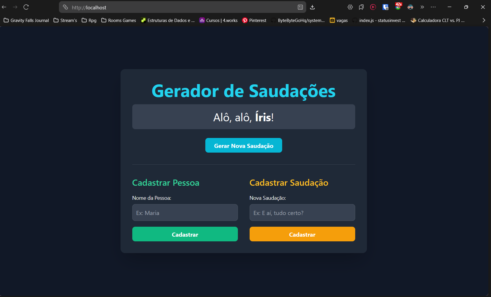

# 🎉 Gerador de Saudações - Desafio Docker

## Descrição do Projeto

Este projeto implementa uma aplicação web que gera **saudações aleatórias para pessoas aleatórias**. A arquitetura é baseada em **microsserviços** containerizados com Docker, permitindo escalabilidade e fácil manutenção.

### 🏗️ Arquitetura

```
┌─────────────────────────────────────────────────────────┐
│          Site Gerador de Saudações (Nginx)              │
│                   Porta: 80 -> 8080                      │
│  (Interface web simples - HTML/CSS/JavaScript)          │
└──────────────────┬──────────────────────────────────────┘
                   │
    ┌──────────────┴──────────────┐
    │                             │
    ▼                             ▼
┌─────────────────────────┐  ┌──────────────────────┐
│  MS Pessoas Aleatórias  │  │ MS Saudações Aleatórias
│      (FastAPI/Python)   │  │   (Gin/Go)          │
│     Porta: 8000         │  │  Porta: 8080        │
└─────────────────────────┘  └──────────────────────┘
```

### 📁 Estrutura do Projeto

```
desafio_imagem_docker/
├── docker-compose.yaml                 # Orquestração dos containers
│
├── site-gerador-saudacoes/             # 🌐 Frontend (Nginx)
│   ├── Dockerfile
│   ├── index.html
│   └── docs/
│       └── docker.md
│
├── ms-pessoas-aleatorias/              # 👥 Microsserviço Python
│   ├── Dockerfile
│   ├── main.py
│   ├── requirements.txt
│   ├── models.py
│   ├── schemas.py
│   ├── database.py
│   └── docs/
│       └── docker.md
│
└── ms-saudacoes-aleatorias/            # 👋 Microsserviço Go
    ├── Dockerfile
    ├── main.go
    ├── go.mod
    ├── handlers/
    ├── models/
    ├── database/
    └── docs/
        └── docker.md
```

---

## 🚀 Guia de Implementação

### Pré-requisitos

- ✅ **Docker Desktop** ou Docker Engine instalado
- ✅ **Docker Compose** (incluído no Docker Desktop)
- ✅ **Conta no Docker Hub** ([hub.docker.com](https://hub.docker.com))
- ✅ **Git** instalado

---

## 📋 Passo 1: Dockerfiles

Os três Dockerfiles já estão criados no projeto:

### 1.1 - Dockerfile do Site Gerador (Nginx)

**Arquivo:** `site-gerador-saudacoes/Dockerfile`

```dockerfile
# --- Estágio 1: Definir a imagem base ---
FROM nginx:alpine

# --- Estágio 2: Copiar os arquivos do projeto ---
COPY index.html /usr/share/nginx/html/index.html

# --- Estágio 3: Expor a porta ---
EXPOSE 80
```

**Características:**

- Imagem base: `nginx:alpine` (ultraleve)
- Copia o arquivo HTML para o diretório padrão do Nginx
- Expõe porta 80

---

### 1.2 - Dockerfile do Microsserviço Pessoas (Python)

**Arquivo:** `ms-pessoas-aleatorias/Dockerfile`

```dockerfile
# --- Estágio 1: Builder ---
FROM python:3.13-slim AS builder

WORKDIR /app

RUN pip install --upgrade pip

COPY requirements.txt .

RUN pip wheel --no-cache-dir --wheel-dir /app/wheels -r requirements.txt

# --- Estágio 2: Final ---
FROM python:3.13-slim

WORKDIR /app

COPY --from=builder /app/wheels /app/wheels

COPY . .

RUN pip install --no-cache-dir /app/wheels/*

EXPOSE 8000

CMD ["uvicorn", "main:app", "--host", "0.0.0.0", "--port", "8000"]
```

**Características:**

- Multi-stage build para otimização
- Base: `python:3.13-slim`
- Instala dependências do `requirements.txt`
- Executa FastAPI/Uvicorn na porta 8000

---

### 1.3 - Dockerfile do Microsserviço Saudações (Go)

**Arquivo:** `ms-saudacoes-aleatorias/Dockerfile`

```dockerfile
# --- Estágio de Build ---
FROM golang:1.24-alpine AS builder

RUN apk add --no-cache build-base gcc

WORKDIR /app

COPY go.mod go.sum ./

RUN go mod download

COPY . .

RUN CGO_ENABLED=1 GOOS=linux go build -a -installsuffix cgo -o /app/main .

# --- Estágio Final ---
FROM alpine:latest

WORKDIR /app

COPY --from=builder /app/main .

EXPOSE 8080

CMD ["./main"]
```

**Características:**

- Multi-stage build (compile + runtime)
- Base: `golang:1.24-alpine` para compilação, `alpine:latest` para execução
- Binário compilado estaticamente
- Executa na porta 8080

---

## 🐳 Passo 2: Fazer Login no Docker Hub

```powershell
docker login
```

Você será solicitado a fornecer seu **nome de usuário** e **senha** do Docker Hub.

---

## 🔨 Passo 3: Build das Imagens Docker

Execute os comandos de build para cada microsserviço. **Substitua `seu-usuario-dockerhub` pelo seu nome de usuário real do Docker Hub.**

### 3.1 - Build do Site Gerador

```powershell
cd site-gerador-saudacoes
docker build -t yagomaia77/gerador-saudacoes:1.0 .
cd ..
```

### 3.2 - Build do Microsserviço Pessoas

```powershell
cd ms-pessoas-aleatorias
docker build -t yagomaia77/ms-pessoas-aleatorias:1.0 .
cd ..
```

### 3.3 - Build do Microsserviço Saudações

```powershell
cd ms-saudacoes-aleatorias
docker build -t yagomaia77/ms-saudacoes-aleatorias:1.0 .
cd ..
```

---

## 📤 Passo 4: Publicar Imagens no Docker Hub

```powershell
# Push do Site Gerador
docker push yagomaia77/gerador-saudacoes:1.0

# Push do Microsserviço Pessoas
docker push yagomaia77/ms-pessoas-aleatorias:1.0

# Push do Microsserviço Saudações
docker push yagomaia77/ms-saudacoes-aleatorias:1.0
```

---

## 🐳 Passo 5: Docker Compose

O arquivo `docker-compose.yaml` já está configurado e pronto:

```yaml
services:
  site:
    image: yagomaia77/gerador-saudacoes:1.0
    ports:
      - "80:80"
    depends_on:
      - ms-pessoas-aleatorias
      - ms-saudacoes-aleatorias
    networks:
      - backend

  ms-pessoas-aleatorias:
    image: yagomaia77/ms-pessoas-aleatorias:1.0
    ports:
      - "8000:8000"
    networks:
      - backend

  ms-saudacoes-aleatorias:
    image: yagomaia77/ms-saudacoes-aleatorias:1.0
    ports:
      - "8080:8080"
    networks:
      - backend

networks:
  backend: {}
```

---

## 🚀 Passo 6: Executar a Aplicação

### 6.1 - Remover Imagens Locais (Recomendado)

Para garantir que o Docker Compose use as imagens do Docker Hub:

```powershell
# Remove todas as imagens locais (cuidado!)
docker system prune -a --volumes -f

# Ou remova apenas as imagens específicas
docker rmi yagomaia77/gerador-saudacoes:1.0
docker rmi yagomaia77/ms-pessoas-aleatorias:1.0
docker rmi yagomaia77/ms-saudacoes-aleatorias:1.0
```

### 6.2 - Iniciar os Containers

Navegue até a **raiz do projeto** (onde está o `docker-compose.yaml`) e execute:

```powershell
docker compose up -d
```

✅ O Docker Compose irá:

1. Baixar as imagens do Docker Hub
2. Criar uma rede chamada `backend`
3. Iniciar os 3 containers

### 6.3 - Verificar Status

```powershell
docker compose ps
```

Você deve ver algo como:

```
CONTAINER ID   IMAGE                                      STATUS     PORTS
abc123         yagomaia77/gerador-saudacoes:1.0          Up 10s    0.0.0.0:80->80/tcp
def456         yagomaia77/ms-pessoas-aleatorias:1.0      Up 8s     0.0.0.0:8000->8000/tcp
ghi789         yagomaia77/ms-saudacoes-aleatorias:1.0    Up 5s     0.0.0.0:8080->8080/tcp
```

---

## 🌐 Passo 7: Acessar a Aplicação

Abra seu navegador e acesse:

- 🌐 **Site Gerador:** http://localhost (porta 80)
- 🔗 **API Pessoas:** http://localhost:8000
- 🔗 **API Saudações:** http://localhost:8080

Se tudo funcionar corretamente, você verá a página do Gerador de Saudações funcionando! 🎉



---

## 🛑 Parar a Aplicação

```powershell
# Parar os containers
docker compose down

# Parar e remover volumes
docker compose down -v

# Parar e remover tudo
docker compose down --volumes --remove-orphans
```

---

## 📝 Resumo da Entrega do Desafio

Conforme solicitado, as evidências de entrega são:

### 1. ✅ Código dos 3 Dockerfiles

- **Site Gerador:** `site-gerador-saudacoes/Dockerfile` (14 linhas)
- **MS Pessoas:** `ms-pessoas-aleatorias/Dockerfile` (47 linhas)
- **MS Saudações:** `ms-saudacoes-aleatorias/Dockerfile` (30 linhas)

### 2. ✅ Código do docker-compose.yaml

- **Arquivo:** `docker-compose.yaml`
- **3 serviços definidos** com rede compartilhada
- **Portas mapeadas** corretamente
- **Dependências configuradas**

### 3. 📸 Captura de Tela da Página Funcionando

Execute os passos acima e capture uma screenshot de `http://localhost` mostrando a página do Gerador de Saudações funcionando.

---

## 🔗 Referências Úteis

- [Docker Documentation](https://docs.docker.com/)
- [Docker Hub](https://hub.docker.com/)
- [Docker Compose Documentation](https://docs.docker.com/compose/)
- [Best Practices for Dockerfiles](https://docs.docker.com/develop/develop-images/dockerfile_best-practices/)

---

## 👨‍💻 Informações do Projeto

- **Versão:** 1.0
- **Data:** Fevereiro/2026
- **Desafio:** Criação de Imagens Docker, publicação no Docker Hub e orquestração com Docker Compose

---

**Tudo pronto! Execute os passos acima de 1 a 7 para ter sua aplicação rodando! 🚀**
